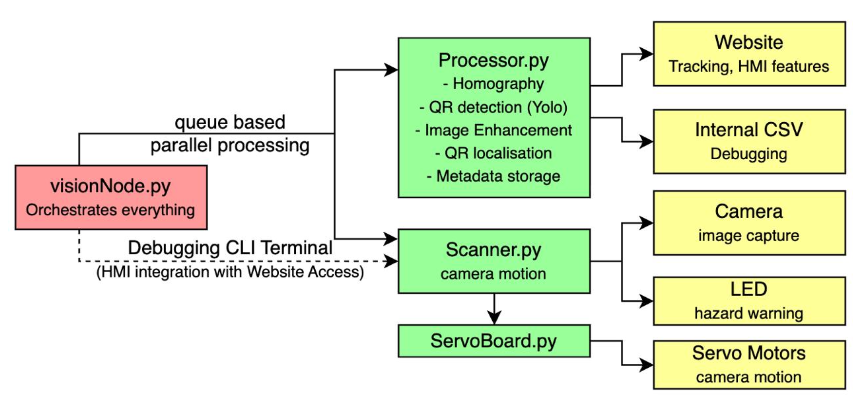
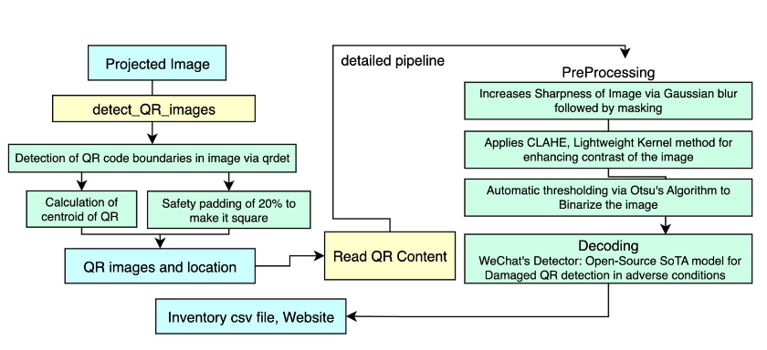
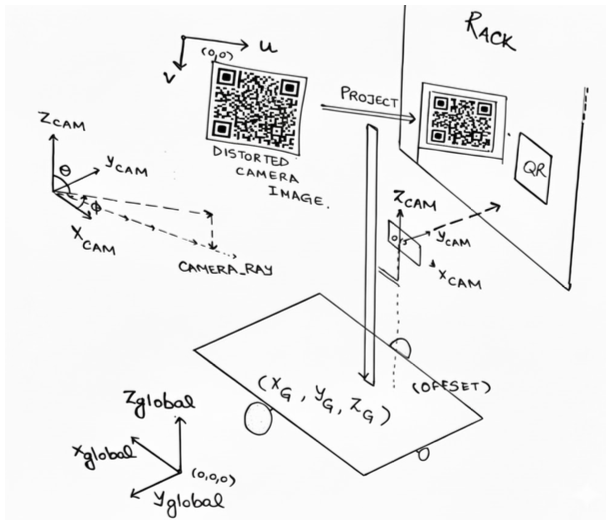
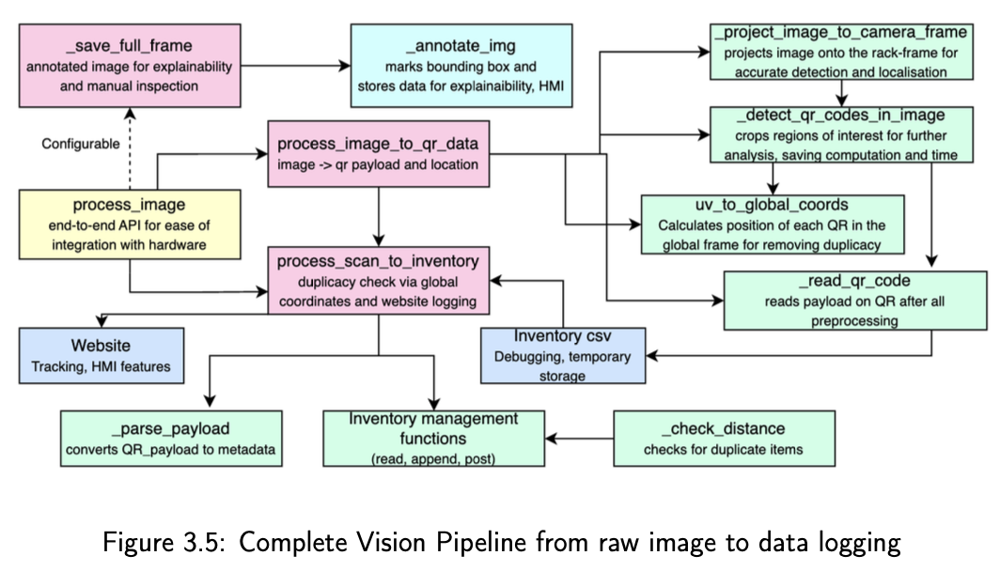

### PROJECT SACRID
- Working in a team of 11, we developed an automated inventory management bot at SAC, Robotics club, IIT Delhi (Hence the name, SACRID) that can currently read QR codes and log their data. 
- We optimised it for dark, narrow alleyways by adding robust QR enhancement pipelines and Homographic corrections based on the camera's and robot's orientation (input from a separate SLAM code). The code also includes smoke tests, detailed error logs and fail-safes, and a dedicated debugging mode for Human-Machine Interaction. It's compliant with the ROS2 framework.

#### Contributors:
**Mahesh Pareek** : Github Mahesh-pareek @ https://github.com/Mahesh-pareek  
**Preesha Agrawal** : Github Preesha07 @  https://github.com/Preesha07  
(Me) **Siddhant Agrawal** : Github Siddhant-135 @ https://github.com/Siddhant-135  

### Project Structure
- The code controls 2 servo motors, determining the theta and phi of the camera. It takes multiple images, selects the sharpest one, then projects the image into a head-on position while calculating its location in the global coordinate frame. Then it bounds each QR Code in a box, stores this annotated image, and sends off each QR-snapshot for rounds of processing and decoding. The gathered data is stored in Inventory.csv after removing duplicates by matching payload and location.
- As for the exact structure of the code, our VisionNode.py (part of a larger ROS2 framework) implements a Multiprocessing Queue running hardware aspects from (Camera Motion, Image capture and filtering, LEDs and Flashlight) and Image Analysis(Homography, Localisation, Payload detection and Logging results) in parallel. The images below should make it clearer.

### Planned Enhancements (Contributions welcome)
While the current code is specific to a particular set of Hardware, we have some generalisations underway  
- Separate the localisation and detection pipelines to enable users to choose between general OCR, QR, Aruko markers or custom object detections
- Implement absolute general motion of camera: Minor modification, currently we have precomputed matrices for the angles we require from our camera, we'll make it easier to input your configurations by taking it directly from the config file rather than the code
- Autocompute d, the distance of the camera from the rack, for use with autofocus camera's. Currently, the distance to the measured objects is hardcoded, but we can use the dimensions of the object to be detected / SLAM to adjust to varying distances. This will require calibrating the camera (K, D values) for different distances and live communication with Arducams, something to be figured out.

